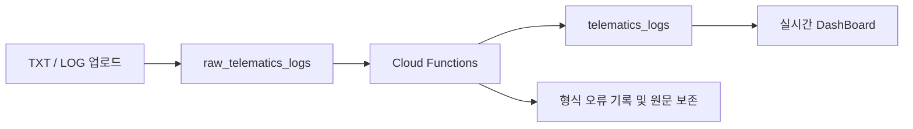

# AURELIA DRIVE × DRIVE / LOG

PJT1 인포테인먼트의 `SETTING` 메뉴에서 차량 로그 DashBoard로 진입하는 PJT2 통합 프로젝트입니다. 차량 로그를 업로드하면 Firebase에서 정제하고 결과를 실시간으로 조회합니다. 날짜·등급·사용자·키워드로 기록을 찾고, 열별 정렬과 상세창을 통해 주행 상태와 이벤트를 확인할 수 있습니다.

## 제출 정보

| 구분 | 내용 |
| --- | --- |
| 지역·반 | 서울 20반 |
| 팀원 | 장문수(1644387), 최현준(1645145) |
| 프로젝트 | 임베디드 웹 관통 PJT2 · 로그 데이터 관리 |
| 최종 제출 | [GitLab 저장소](https://lab.ssafy.com/s16/a20/20260911-pjt-2/1644387-1645145) |
| 프로젝트 공유 | [GitHub 저장소](https://github.com/DRIVE-LOG/DRIVE-LOG) |
| 결과 문서 | [구현 결과와 실행 화면](submission/RESULTS.md) |
| 파일 목록 | [압축 내부 전체 파일과 제외 항목](submission/FILES.md) |
| 제출 파일 | [임베디드_웹_관통PJT2_서울_20반_장문수_최현준.zip](임베디드_웹_관통PJT2_서울_20반_장문수_최현준.zip) |

GitLab에는 최종 제출본을, GitHub에는 동일한 프로젝트 파일과 README를 제공합니다. 두 저장소의 기존 커밋 이력은 각각 유지합니다.

## 제출 파일 안내

| 산출물 | 위치 | 포함 내용 |
| --- | --- | --- |
| 프로젝트 안내 | `README.md` | 통합 흐름, 설치·실행, Firebase 준비, 기능 및 검증 |
| 최종 결과 문서 | `submission/RESULTS.md` | 요구사항 대응, 개선된 요구사항, 실행 결과 |
| 실행 화면 6장 | `submission/screenshots/` | HOME, DashBoard, 검색·정렬, 상세, 업로드 미리보기·완료 |
| 전체 구현 소스 | `infotainment/`, `dist/`, `functions/` | PJT1 통합 화면, 로그 UI, Firebase 정제 처리 |
| 실행·검증 파일 | `scripts/`, `tests/`, 패키지·Firebase 설정 파일 | 서버, 빌드, 자동 테스트, 의존성 잠금, 규칙·인덱스 |
| 설계·연동 문서 | `docs/` | 요구사항별 구현 위치와 Firebase 검증 기록 |
| 압축 파일 목록 | `submission/FILES.md`, ZIP 내부 `MANIFEST.sha256` | 파일별 경로와 무결성 확인용 SHA-256 |
| 제출 ZIP | 최상위 `임베디드_웹_관통PJT2_서울_20반_장문수_최현준.zip` | 위 소스·문서·캡처를 하나의 프로젝트 폴더로 압축 |

압축 파일명은 `임베디드_웹_관통PJT2_지역_반_성명1_성명2.zip` 형식입니다. 개선된 요구사항과 실행 화면은 결과 문서에 포함하며 소스와 함께 압축합니다. ZIP 자체는 ZIP 내부에 중복 포함하지 않습니다.

최종 결과 문서는 명세서에서 허용한 Markdown 문서 형식으로 제공합니다. 개선된 요구사항과 실행 캡처가 포함되어 있으므로 별도 Word 또는 PowerPoint 파일은 필수 제출물이 아닙니다.

## 실행 흐름

**PJT1 HOME → 하단 SETTING → 로그 DashBoard → 하단 HOME 복귀**

차량 배경과 태블릿 헤더·하단 메뉴를 공통으로 사용합니다. 로그 화면은 같은 주소의 `/logs/`에서 로드하며, HOME으로 이동했다 돌아와도 화면을 다시 생성하지 않아 필터와 정렬 상태를 유지합니다.

이번 제출 범위는 PJT1 화면 연계와 Firebase 로그 기능입니다. 지도·길안내·날씨 화면과 기존 소스는 유지하지만 외부 API 초기화는 호출하지 않습니다. 지도·날씨 값은 기존 정적 화면이며 실시간 API 데이터가 아닙니다. 이 기능들의 API 키 없이 통합 앱을 실행할 수 있습니다.

## 주요 기능

| 기능 | 동작 |
| --- | --- |
| 실시간 DashBoard | 로그 수, 사용자 수, 주의·위험 이벤트, 데이터 확인 필요 건수 표시 |
| 파일 업로드 | TXT/LOG 미리보기, 진행률, 실패 행 재시도, 저장 성공 시 창 자동 닫기 |
| 자동 정제 | Firestore 문서 생성 시 Cloud Functions가 원문을 구조화된 로그로 변환 |
| 복합 검색 | KST 날짜 범위, 로그 등급, 사용자 ID, 키워드 필터 조합 |
| 열별 정렬 | 기록 시각·등급·사용자·메시지·속도·엔진 열을 기본 → 오름차순 → 내림차순 순서로 전환 |
| 로그 상세 | 행 클릭으로 상세창 표시, 좌우 버튼·방향키로 이전/다음 로그 이동 |
| 중복 방지 | 같은 로그가 포함된 파일을 재업로드해도 기존 문서를 재사용 |
| 접근 제어 | 인증 사용자별 데이터 조회, 정제 데이터의 클라이언트 직접 수정 차단 |

기본 정렬은 최신순입니다. 등급은 `DEBUG → INFO → WARNING → ERROR → CRITICAL` 순으로 정렬하며, 누락값은 정렬 방향과 관계없이 마지막에 표시합니다. 상세창은 열린 시점의 필터·정렬 결과를 기준으로 페이지 경계를 넘어 탐색합니다.

## 기술 구성

| 구분 | 사용 기술 |
| --- | --- |
| 프런트엔드 | HTML, CSS, JavaScript, Axios, 같은 출처의 iframe 화면 통합 |
| 로컬 서버 | Node.js, Express, dotenv |
| 인증 | Firebase Authentication 익명 로그인 |
| 데이터베이스 | Cloud Firestore |
| 서버 처리 | Cloud Functions for Firebase 2세대, Admin SDK |
| 런타임 | 로컬 Node.js 22 이상, Functions Node.js 22 |
| 검증 | Node.js 내장 테스트 러너, 정적 연결 검사 |



## 시작하기

Node.js 22 이상과 연결할 Firebase 웹 앱 설정이 필요합니다.

```bash
git clone https://lab.ssafy.com/s16/a20/20260911-pjt-2/1644387-1645145.git
cd 1644387-1645145
npm ci
```

GitHub를 이용할 경우 아래 명령으로 같은 프로젝트를 받을 수 있습니다. ZIP을 받은 경우에는 압축을 푼 프로젝트 폴더에서 `npm ci`부터 실행합니다.

```bash
git clone https://github.com/DRIVE-LOG/DRIVE-LOG.git
cd DRIVE-LOG
npm ci
```

`dist/config.js`를 같은 폴더의 `config.local.js`로 복사한 뒤 Firebase Console에서 확인한 웹 앱 설정을 입력합니다.

```js
export const firebaseConfig = {
  apiKey: 'YOUR_WEB_API_KEY',
  authDomain: 'YOUR_PROJECT_ID.firebaseapp.com',
  projectId: 'YOUR_PROJECT_ID',
  appId: 'YOUR_WEB_APP_ID'
};
export const useEmulators = false;
```

```bash
npm start
```

[로컬 인포테인먼트](http://127.0.0.1:4173/)를 열고 하단 **SETTING**을 누르면 설정된 Firebase 프로젝트에 자동 연결합니다. 로그 화면 직접 진입은 `http://127.0.0.1:4173/#settings`입니다. 새 프로젝트를 사용하는 경우 아래 백엔드 설정을 먼저 완료하세요.

`config.local.js`와 `.firebaserc`는 저장소에 포함하지 않습니다. Firebase 웹 설정은 브라우저에서 사용하는 공개 식별 정보이며, 데이터 권한은 Authentication과 Firestore 규칙으로 통제합니다. 서비스 계정 개인 키는 프런트엔드에 넣지 않습니다.

### Firebase 백엔드 설정

1. Firebase 프로젝트와 웹 앱을 생성합니다.
2. Firestore Standard 데이터베이스를 생성합니다. 이 프로젝트의 Functions 리전은 서울 `asia-northeast3`입니다.
3. Authentication에서 익명 로그인을 활성화합니다.
4. Cloud Functions를 사용할 수 있도록 Blaze 요금제와 배포 권한을 준비합니다.
5. 서버 의존성을 설치하고 프로젝트를 선택한 뒤 배포합니다.

```bash
npm ci --prefix functions
npx firebase login
npx firebase use --add
npx firebase deploy --only firestore,functions
```

복합 인덱스가 준비되면 DashBoard에서 로그를 업로드할 수 있습니다. 원문 저장과 자동 정제는 비동기로 진행되므로 저장 성공 후 처리된 로그부터 표시됩니다.

### 로그 파일 형식

한 행이 하나의 기록입니다. 다음은 형식을 설명하기 위한 작성 예시입니다.

```text
[2025-07-05 08:00:00 | driver_01 | INFO | Speed=42 km/h Accel=-1.5 m/s² Brake=OFF Dist=120 km EngTemp=85 °C FuelEff=14 km/L
[2025-07-05 08:01:00 | driver_01 | WARNING | Event=Collision Impact=Low Speed=0 km/h Location=37.5,127.1
```

- 최대 5 MB, 10,000행, 행당 10,000자까지 처리합니다.
- 원본 시각은 한국 시간으로 해석하고 Firestore에는 Timestamp로 저장합니다.
- 음수 가속도, 문자 이벤트, 위도·경도를 보존합니다.
- 누락된 측정값은 `null`로 저장하고 확인 필요 항목으로 표시합니다.
- 형식 오류 행은 원문과 실패 사유를 저장하며 정제 목록에서는 제외합니다.
- 원문 해시와 파일 내 반복 순번으로 중복을 판별합니다. 한 파일 안의 반복 행은 반복 횟수만큼 보존합니다.

기본 제공 명세서, PDF, ZIP, 예제 프로젝트 원본 묶음과 원본 데이터 파일은 이 저장소에 포함하지 않습니다. PJT1에서 연계에 사용하는 화면·서버 소스는 `infotainment/`에 포함합니다. 필요한 로그 파일은 직접 준비해 업로드하세요.

### 사용자와 데이터 범위

`ownerUid`는 업로드한 Firebase 인증 사용자이고, `user`는 로그 안의 차량 사용자 ID입니다. 사용자 필터는 `user`를 기준으로 동작합니다.

익명 계정은 같은 브라우저와 사이트에서 유지됩니다. 다른 브라우저·기기·도메인으로 접속하거나 사이트 데이터를 삭제하면 다른 계정이 생성되어 기존 계정의 로그가 보이지 않습니다. 새 계정에 로그가 자동으로 채워지지는 않습니다.

## 검증

```bash
npm test
npm run build
npm run check
```

- 자동 테스트 31개: 정제와 누락값 처리, KST 변환, 복합 필터, 3단계 정렬, 중복 방지, 업로드 동시성·실패 재시도, Functions 처리 흐름, 통합 경로와 PJT1 서버의 기존 동작을 검증합니다. PJT1 API 테스트는 모의 응답을 사용하며 실제 지도·날씨 서버에 접속하지 않습니다.
- 테스트는 코드에 작성한 독립적인 입력값을 사용하므로 기본 제공 파일이나 Firebase 접속 없이 실행됩니다.
- 정적 검사는 JavaScript 문법, HTML ID 연결, 리소스 경로, JSON 설정, 공통 모듈의 빌드 일치 여부를 확인합니다.
- 실제 Firebase에서는 인증·접근 차단·자동 정제와 1,000건 조회를 확인했습니다. 브라우저에서 정렬, 상세 탐색, 업로드 성공 시 창 닫힘도 확인했습니다.

별도의 클라우드 통합 검사:

```bash
node scripts/firebase-smoke.mjs
```

이 명령은 설정된 Firebase 프로젝트에 테스트용 익명 계정 2개와 원시 문서 11개를 생성합니다. 기본 테스트에는 포함하지 않으며 실행 결과는 Git에서 제외된 `output/`에 저장합니다. 제공 데이터 파일은 필요하지 않습니다.

## 실행 화면


필터·정렬·상세·업로드 화면은 [결과 문서](submission/RESULTS.md)에 수록했습니다.

## 프로젝트 구조

```text
1644387-1645145/
├─ infotainment/              # PJT1 소스와 SETTING 진입 화면
│  ├─ public/                 # 차량 배경, 공통 헤더·HOME·SETTING 메뉴
│  ├─ server.js               # 기존 Express 앱
│  └─ test/                   # PJT1 서버 테스트
├─ dist/
│  ├─ index.html              # DashBoard 및 상세·업로드 창
│  ├─ style.css               # 레이아웃과 등급·정렬 표시
│  ├─ app.js                  # 화면 상태, 필터, 정렬, 상세 탐색
│  ├─ services.js             # Firebase 인증·구독·업로드
│  └─ config.js               # Firebase 설정 예시
├─ functions/
│  ├─ index.js                # 문서 생성 트리거
│  ├─ processor.js            # 정제 및 처리 상태 트랜잭션
│  └─ lib/                    # 공통 파서·조회·업로드 로직
├─ scripts/                   # 빌드, 로컬 서버, 검사
├─ tests/                     # 독립적인 자동 테스트
├─ docs/                      # 구현 설계와 연동 검증 기록
├─ submission/                # 결과 문서·실행 캡처·파일 목록
├─ 임베디드_웹_관통PJT2_서울_20반_장문수_최현준.zip  # 제출 압축 파일
├─ firebase.json              # 배포 및 에뮬레이터 설정
├─ firestore.rules            # 사용자별 접근 규칙
├─ firestore.indexes.json     # 실시간 조회 인덱스
└─ .firebaserc.example        # 프로젝트 선택 설정 예시
```

`dist/`의 HTML·CSS·JS는 편집하는 소스입니다. `npm run build`는 공통 모듈과 Axios를 `dist/lib`, `dist/vendor`로 복사합니다. 이 두 폴더는 생성물이므로 Git에서 제외합니다.

## 운영 및 제출물 재생성

통합 화면은 `npm start`로 실행합니다. 포트를 바꿀 때는 `DRIVE_LOG_PORT` 환경변수를 사용합니다. 기본 주소는 `http://127.0.0.1:4173`입니다. `localhost` 또는 다른 포트로 바꾸면 Firebase 익명 인증 저장소의 출처가 달라져 기존 로그가 보이지 않을 수 있으므로 시연 시 같은 주소와 브라우저를 사용합니다.

Firebase 배포는 앞서 안내한 Firestore 규칙·인덱스·Functions를 대상으로 합니다. 현재 `firebase.json`의 Hosting 설정은 독립 로그 화면용이며, 통합 인포테인먼트 공개 배포는 이번 제출 범위에 포함하지 않습니다.

Functions의 장기 자동 재시도는 비활성화되어 있습니다. 서버 오류로 `pending`에 남은 문서는 Functions 로그를 확인한 후 복구해야 합니다. 조회는 사용자 소유 로그를 구독한 뒤 브라우저에서 필터·정렬하는 방식입니다.

```bash
npm run package:submission
```

패키징은 프로젝트 소스, 결과 문서, 실행 화면 캡처를 프로젝트 최상위의 지정 이름 ZIP으로 구성하고 `submission/FILES.md`를 실제 파일 목록으로 갱신합니다. ZIP 내부에는 각 파일의 SHA-256을 기록한 `MANIFEST.sha256`도 생성합니다. 압축 내부 README는 ZIP 자체를 가리키는 다운로드 링크만 파일명으로 바꾸며 나머지 안내는 저장소와 같습니다.

`.git`, 의존성 설치 폴더, 원본 PDF·ZIP·데이터, 실제 Firebase 설정, `.env`, 개인 키, 임시 출력은 GitLab·GitHub·제출 ZIP에서 모두 제외합니다. Firebase의 실제 데이터베이스 내용도 Git에 내보내지 않습니다. 실행 캡처와 검증 집계만 결과 문서에 포함합니다. 새 환경은 개인 Firebase 설정과 업로드할 로그가 필요하며, 설정 후 위의 설치·실행 절차를 따르면 됩니다.

자세한 내용은 [구현 설계](docs/requirements.md)와 [Firebase 연동 검증](docs/firebase-connection.md)을 참고하세요.
