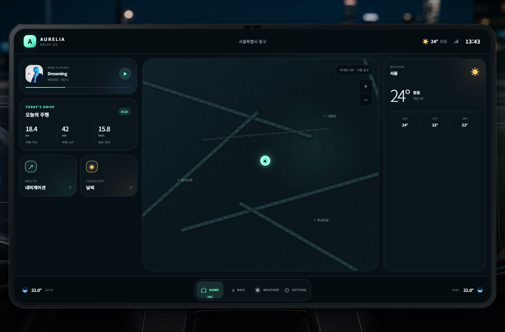
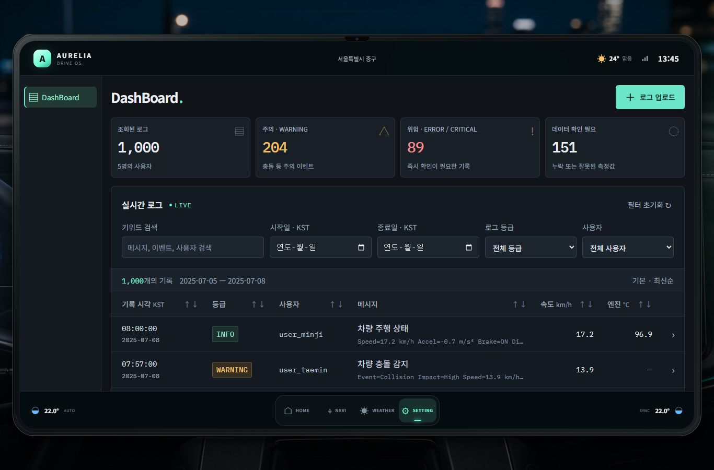
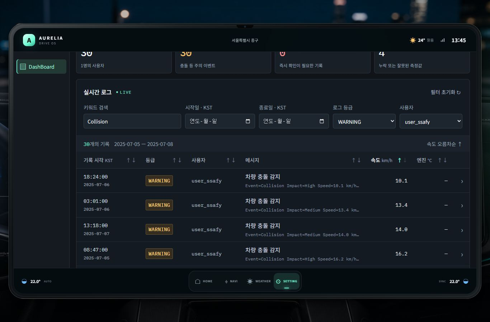
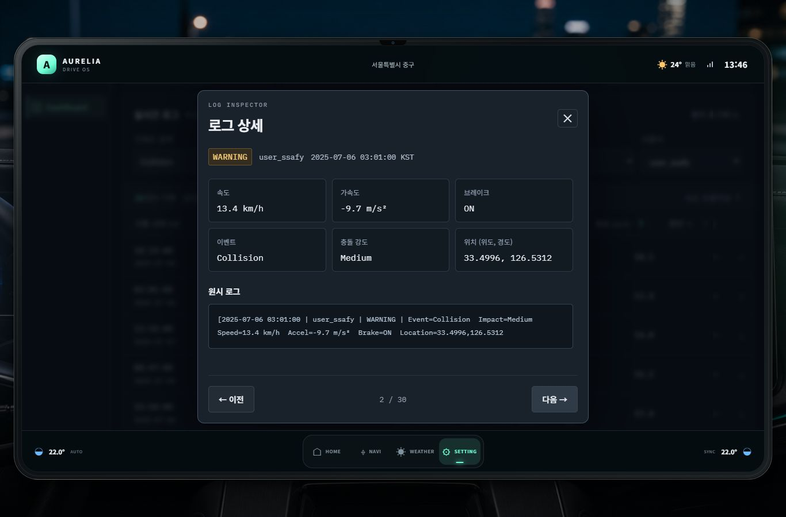
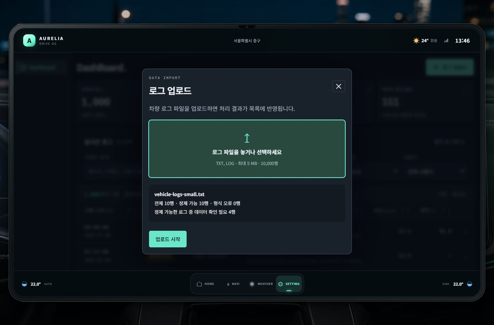
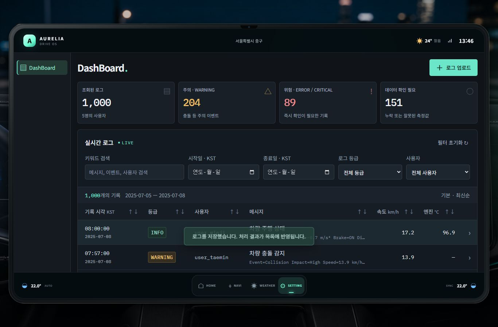

# 임베디드 웹 관통 PJT2 최종 결과

## 팀 및 제출 정보

- 지역·반: 서울 20반
- 장문수: 1644387
- 최현준: 1645145
- 제출 파일명: `임베디드_웹_관통PJT2_서울_20반_장문수_최현준.zip`
- 제출 저장소: https://lab.ssafy.com/s16/a20/20260911-pjt-2/1644387-1645145
- 동일 프로젝트 공유: https://github.com/DRIVE-LOG/DRIVE-LOG
- 압축 내부 전체 목록: [FILES.md](FILES.md)

## 제출 구성 확인

최종 결과 문서에는 개선된 요구사항과 실행 화면 6장을 포함한다. 프로젝트 소스, 루트 README, 실행·검증 스크립트, 의존성 잠금 파일, Firebase 설정 예시·규칙·인덱스와 함께 지정 이름의 ZIP으로 제출한다. 원본 명세서와 제공 예제 묶음, 데이터 파일, 실제 Firebase 설정·인증정보는 제외한다. ZIP 내부의 `MANIFEST.sha256`에는 포함 파일의 해시가 기록된다.

## 구현 범위

PJT1 AURELIA DRIVE의 HOME 화면에 SETTING 메뉴를 추가하고, 기존 DRIVE / LOG DashBoard를 연결했다. 차량 배경, 태블릿 헤더와 고정 하단 HOME 메뉴를 공유한다. 이번 범위는 화면 이동과 Firebase 로그 관리이며 지도·날씨 API는 연결하지 않는다. 해당 영역은 PJT1의 정적 화면을 유지한다.

## 요구사항 구현 결과

| 요구사항 | 구현 내용 | 검증 |
| --- | --- | --- |
| F201 원시 로그 수집 | 파일을 행 단위로 분리해 raw_telematics_logs에 저장, 미리보기·진행률·실패 재시도 제공 | 실제 업로드 및 중복 파일 재업로드 |
| F202 자동 정제 | Firestore onDocumentCreated 트리거로 서버 정제 | 배포된 Functions 처리 검증 |
| F203 구조화 저장 | telematics_logs에 Timestamp·사용자·등급·측정값·품질 항목 저장 | 음수 가속도·좌표·누락값·형식 오류 처리 확인 |
| F204 실시간 시각화 | HOME → SETTING 진입, onSnapshot 구독, 기본 최신순, 공통 HOME 복귀 | 통합 화면 1,000건 및 왕복 이동 확인 |
| F205 검색·필터 | KST 날짜·등급·사용자·키워드 조합 | WARNING + user_ssafy + Collision: 30건 |
| F206 등급 색상 | INFO 민트, WARNING 황색, ERROR/CRITICAL 적색, DEBUG 청색 | 목록·상세창 확인 |
| F207 사용자별 분석 | log.user 기반 사용자 필터 | 다른 검색 조건과 함께 적용 확인 |

## 개선된 요구사항

| 개선 항목 | 반영 결과 |
| --- | --- |
| 기존 차량 화면과 자연스러운 연결 | SETTING에서 같은 출처의 로그 화면 로드, 공통 HOME으로 복귀 |
| 중복 메뉴 제거 | 로그 내부는 DashBoard 메뉴만 표시하며, 파일 등록은 상단 로그 업로드 버튼 사용 |
| 열별 정렬 | 6개 열에 ↑↓ 표시, 기본 → 오름차순 → 내림차순 → 기본 순환 |
| 데이터 유형에 맞는 정렬 | 숫자 비교·등급 심각도·문자열 자연 정렬, 누락값은 마지막 표시 |
| 상세 탐색 | 행 클릭으로 해당 로그만 표시, 좌우 버튼·방향키로 이전/다음 이동 |
| 상태 유지 | HOME 왕복 시 iframe을 다시 만들지 않아 필터·정렬·조회 상태 유지 |
| 업로드 종료 흐름 | 모든 행 저장 성공 시 창 자동 닫기, 일부 실패 시 재시도 화면 유지 |
| 원문 보존·정제 개선 | 감속 음수·문자 이벤트·위도/경도 보존, 누락·이상 값 표시 |
| 중복 방지 | 원문 해시와 반복 순번으로 부분 파일/전체 파일의 중복 기록 방지 |
| 제출 정보 분리 | 개인 설정·키·원본 자료 제외, 재생성 가능한 ZIP 패키징과 해시 목록 제공 |

## 실행 화면

아래 이미지는 통합 앱의 실제 실행 화면이다. Firebase 로그는 실제 데이터이며, 홈의 지도·날씨는 API 미연동 상태의 기존 정적 UI다.

### 1. PJT1 HOME과 SETTING 진입

차량 배경과 기존 화면을 유지하고 하단에 SETTING 버튼을 추가했다.

### 2. SETTING의 실시간 로그 DashBoard

전체 1,000건, 사용자 5명, WARNING 204건, CRITICAL 89건, 확인 필요 151건을 조회했다. 공통 헤더와 하단 HOME 버튼을 유지한다.

### 3. 복합 검색과 열 정렬

WARNING·user_ssafy·Collision 조건을 결합하면 30건이다. 속도 오름차순을 적용했다.

### 4. 로그 상세와 이전·다음 이동

선택한 기록만 표시하며, 현재 필터 결과에서 두 번째 로그로 이동한 화면이다. 음수 가속도와 좌표를 확인할 수 있다.

### 5. 업로드 미리보기

행 수, 정제 가능 여부, 확인이 필요한 데이터를 업로드 전에 안내한다. 검증에 사용한 원본 파일은 제출물에 포함하지 않는다.

### 6. 업로드 성공 후 자동 닫기

기존 10행 파일을 재업로드한 결과, 창이 닫히고 성공 안내가 표시됐다. 중복 없이 1,000건을 유지했다.

## 검증 결과 및 실행 안내

- `npm test`: 31개 통과. 정제·조회·정렬·중복 방지·서버 처리와 통합 경로 검증.
- `npm run build`, `npm run check`: 통과.
- 브라우저: HOME → SETTING → HOME 왕복, 상태 유지, 1,000건 조회, 복합 필터, 상세 이동, 업로드 자동 닫힘 확인.
- 태블릿 및 좁은 화면에서 HOME 하단 메뉴가 유지되는지 확인.
- 지도·날씨 실제 API는 미연동이며 관련 서버 테스트는 모의 응답을 사용.

압축을 푼 프로젝트 폴더에서 `npm ci`를 실행하고 `dist/config.js`를 `dist/config.local.js`로 복사해 본인의 Firebase 웹 설정을 입력한다. `npm start`로 실행한 뒤 `http://127.0.0.1:4173`에서 SETTING으로 진입한다. 새 Firebase 프로젝트라면 루트 README의 인증·Firestore·Functions 설정과 배포 절차를 먼저 따른다.

기존 1,000건은 검증 당시 브라우저의 익명 계정에 속한다. 새 기기·브라우저에서는 해당 계정의 데이터가 자동 제공되지 않으며 로그를 직접 업로드해야 한다. 실제 키, 개인 설정, 데이터 원본, 기본 제공 PDF·ZIP·예제, node_modules는 제출물에서 제외한다.
